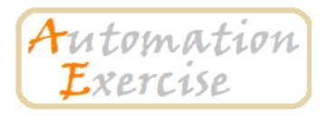

# Automation Exercise Tests




This repository contains automated UI and APi tests for the Automation Exercise web application. It uses Robot Framework together with Selenium and Python to run tests against the test environment. Aim is to test main functionalities and end-to-end scenarios of webservice.

# Setup environment
## Virtual environment
Create virtual environment

```
python -m venv venv
```

Activate virtual environment on Windows

```
venv\Scripts\activate
```
Activate virtual environment on Linux / macOS 
```
source venv/bin/activate
```

Install dependencies from `requirements.txt` 

```
pip install -r requirements.txt
```

Create a file named .env in your local project-root folder and replace <YOUR_USERNAME> and <YOUR_PASSWORD> with your personal login credentials.

```
USER=<YOUR_USERNAME>
PASSWORD=<YOUR_PASSWORD>
```

# Running tests locally

Run tests with command
````
robot -d results ADD_YOUR_TEST_NAME_HERE
````

````
📂 Test results will be saved in the results/ folder.
````

Run tests with Pabot:
````
pabot --processes 3 tests
````

## Running tests with Docker

Start Docker Daemon using Docker Desktop or WSL Ubuntu if installed there. 

### Prerequisites

- Docker Desktop

### Build the Docker image:

```
docker build -t <YOUR_IMAGE_NAME_HERE> .
```

### Run the image with tests:

```
docker run --rm <YOUR_IMAGE_NAME_HERE>
```

